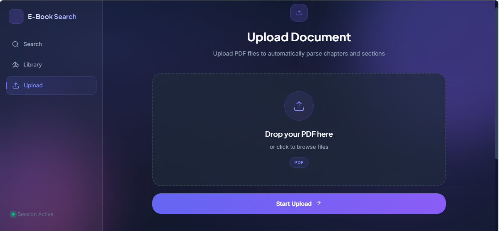
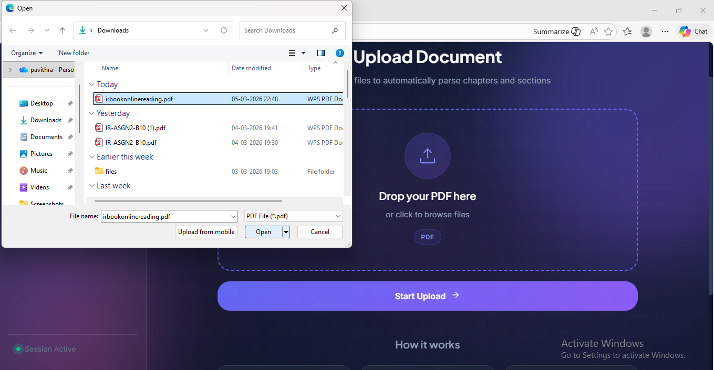
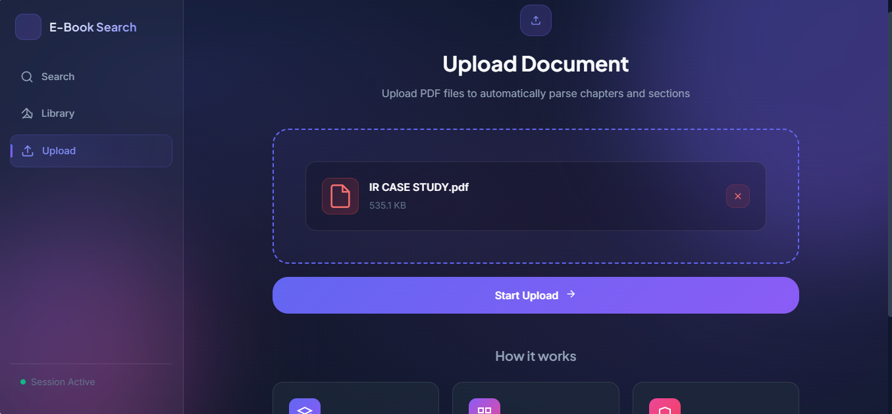
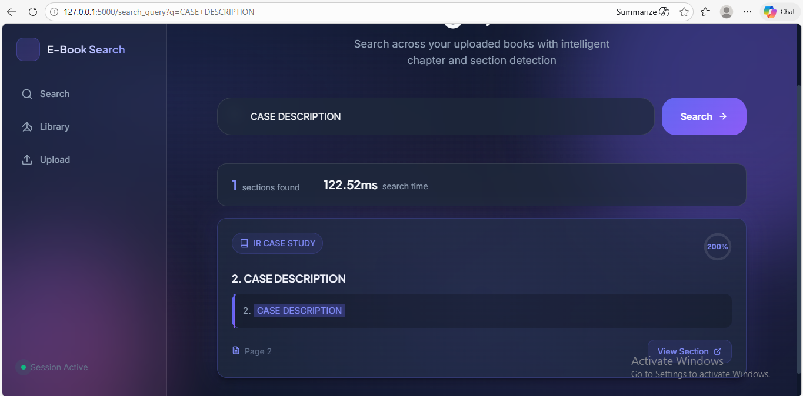
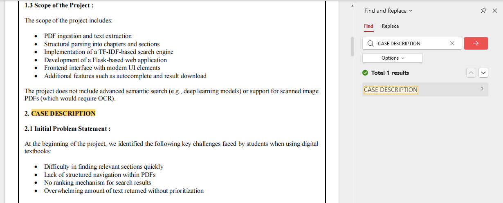
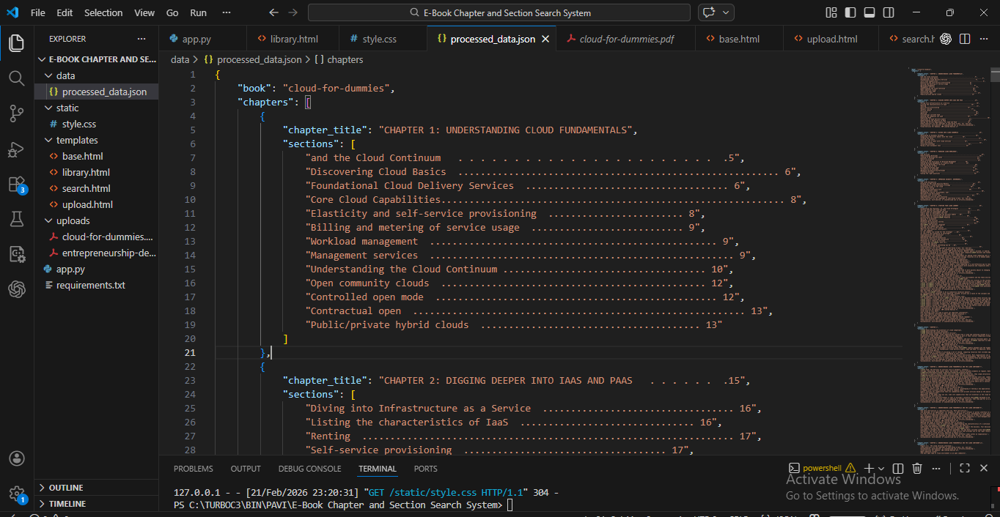
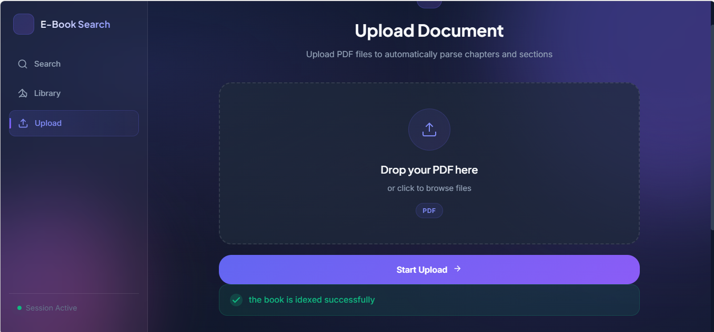
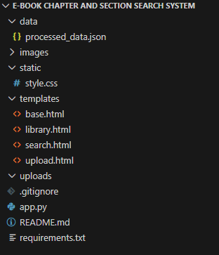

# 📚 E-Book Chapter and Section Search System

---

## 📌 Project Description

The **E-Book Chapter and Section Search System** is a Flask-based Information Retrieval (IR) application that allows users to upload PDF books and perform intelligent search at the **chapter and section level**.

The system processes uploaded books, extracts textual content, and applies Information Retrieval techniques to find the most relevant sections for a given user query.

Each user session is **isolated**, meaning users can search only within the books uploaded during their own session.

The system implements:

• **Vector Space Model (VSM)**  
• **TF-IDF Weighting**  
• **Cosine Similarity Ranking**

to retrieve highly relevant sections from uploaded books.

---

## 🎯 Objective of the Application

The main objective of this system is to create an intelligent search platform that can:

• Upload and process PDF books  
• Automatically detect chapters and sections  
• Convert extracted text into TF-IDF vectors  
• Compare user queries with book content  
• Retrieve the most relevant sections  
• Rank results based on similarity score  
• Highlight query terms inside results  
• Display corresponding page numbers  

---

## 🛠 Tools and Technologies Used

| Tool | Purpose |
|-----|---------|
| Python | Programming Language |
| Flask | Web Application Framework |
| PyPDF2 | PDF Text Extraction |
| Scikit-learn | TF-IDF & Cosine Similarity |
| HTML | Web Interface |
| CSS | Styling |
| JSON | Data Storage |
| Git | Version Control |
| GitHub | Project Repository |
| Render | Cloud Deployment |

---

# 🚀 Project Preview

## 📤 Upload Document







---

## 📚 Library View


---

## 🔍 Search Query Result



---

## 📖 Query Highlight Inside Book



---

## ❌ No Matches Found Case


---

## ⚙️ Automatic Chapter & Section Extraction



---

## ✅ Book Indexed Successfully



---

# 🗂 Project Structure



---

# ⚙ Installation Steps

### Step 1: Clone Repository

```
git clone https://github.com/pavithraB-wec/ebook-chapter-section-search-system.git
```

---

### Step 2: Navigate to Project Folder

```
cd ebook-chapter-section-search-system
```

---

### Step 3: Install Required Dependencies

```
pip install -r requirements.txt
```

---

# ▶ How to Run the Application

Run the Flask application:

```
py -3.12 app.py
```

You will see:

```
Running on http://127.0.0.1:5000/
```

Open your browser and visit:

```
http://127.0.0.1:5000
```

---

# 🚀 Key Project Features

✅ Upload PDF Books  

✅ Automatic Chapter Detection  

✅ Section-Level Text Extraction  

✅ TF-IDF Vector Creation  

✅ Cosine Similarity Ranking  

✅ Intelligent Search Results  

✅ Query Highlighting  

✅ Page Number Display  

✅ Session-Based Book Isolation  

✅ Library View for Uploaded Books  

✅ Delete Uploaded Books  

✅ Automatic Cleanup of Session Data  

---

# 🔐 Session-Based Architecture

This system uses **session-based isolation**, meaning:

• Each user can only see books uploaded in their session  
• Uploaded books are **not shared between users**  
• When a user session ends, their uploaded books are automatically cleaned  

Example:

User A uploads:

```
Python.pdf
```

User B uploads:

```
DataScience.pdf
```

User A will **only see Python.pdf**, while User B will **only see DataScience.pdf**.

---

# 🧠 Information Retrieval Algorithms Used

The system implements fundamental IR algorithms including:

### Vector Space Model (VSM)

Documents and queries are represented as vectors in a multi-dimensional space.

---

### TF-IDF (Term Frequency – Inverse Document Frequency)

TF-IDF assigns importance to words based on how frequently they appear in a document relative to the entire dataset.

Formula:

```
TF-IDF = TF × IDF
```

---

### Cosine Similarity

Cosine similarity measures the similarity between the query vector and document vectors.

Formula:

```
Cosine Similarity = (A · B) / (||A|| × ||B||)
```

The sections with the highest similarity scores are ranked as the most relevant results.

---

# 🔍 System Workflow

The system processes queries through the following pipeline:

```
Upload PDF
     ↓
Extract Text from Pages
     ↓
Detect Chapters & Sections
     ↓
Store Structured Data
     ↓
Generate TF-IDF Vectors
     ↓
User Query Processing
     ↓
Cosine Similarity Calculation
     ↓
Rank Results
     ↓
Display Relevant Sections
```

---

# 🌐 Live Application

The project is deployed online using **Render**.

Users can upload books and search within their own session.

---

# 👩‍💻 Author

**Name:** Pavithra B  

**Course:** B.Tech – Information Science and Engineering  

**Year:** III Year  

**College:** Women’s Engineering College  

**Project Title:**  
E-Book Chapter and Section Search System  
(Flask-Based Information Retrieval System)

---

# 📌 GitHub Repository

```
https://github.com/pavithraB-wec/ebook-chapter-section-search-system
```

---

# ⭐ Conclusion

This project demonstrates a real-world implementation of **Information Retrieval techniques** using Flask, TF-IDF, and Cosine Similarity to perform efficient chapter and section-level search in E-Books.

The system provides fast, structured, and ranked search results while maintaining **session-based isolation and automatic cleanup**, making it scalable for multiple users.

---
